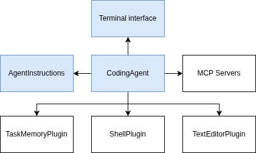

Welcome to the agent loop module of the workshop. In this module you'll learn:

- How to create an agent that can perform actions on behalf of the user
- What the agent loop is and how to implement one from scratch
- How to integrate an agent with a terminal interface

## Architecture of the coding agent

We'll start building the agent by discussing the architecture of the agent first.
There are many ways to build an agent, but in this workshop we'll build a very
basic user interface and focus our attention on the rest of the agent.

The diagram above shows the components we'll build in this module and throughout
the rest of the workshop. The core will be the `CodingAgent` class. This class
will implement the agent loop we'll discuss in the next section.

One of the key components of the agent will be the `IAgentCallbacks` interface. 
This interface allows the agent to send information back to the terminal.

The `CodingAgent` class will use two plugins that we'll discuss in the next
module **Agent Tools**. The first plugin is the *ShellPllugin** that allows
the agent to run shell commands. The second plugin is the `TextEditorPlugin`
that allows the agent to edit and read files.

Next to the tools, we'll also implement a component called `AgentInstructions`
that will provide the agent with custom instructions defined by the user.
We'll implement this together with `TaskMemoryPlugin` in the module 
**Task Memory**.

Finally, the agent will have access to one or more MCP servers that will host
even more custom tools. We'll cover MCP servers in the final module
**MCP Servers**.

## What we'll build in this module

We have some ground to cover in this module. Here are the steps we'll take:

1. [Create the agent application](/modules/agent-loop/create-agent-application)
2. [Implement the agent loop](/modules/agent-loop/implement-agent-loop)
3. [Connect the terminal interface](/modules/agent-loop/connect-terminal-interface)
4. [Test the agent](/modules/agent-loop/testing)

Let's get started with the first step!