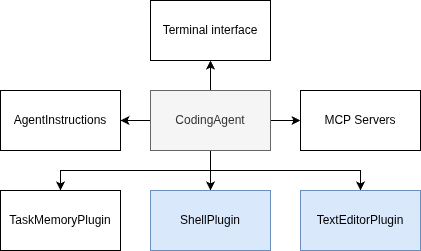

import { Card } from '@astrojs/starlight/components';

In this module, we'll learn how to build tools for the agent. By the end of the
module you'll know:

- What tools a coding agent needs to be effective
- How to implement plugins and tools in Semantic Kernel
- How to test custom plugins and tools



## Using tools with an LLM

In [Implementing the agent loop](/modules/agent-loop/implement-agent-loop), we
discussed how an LLM can use tools to extend its capabilities beyond text
generation. We didn't discuss yet how to create those tools, and how the LLM 
even knows what tools to call. 

Tools are described  to the LLM using JSON schemas not unlike how you would
describe functions in an OpenAPI specification for a REST API. The schema
describes the name of the tool, its parameters, and a description of what the
tool does.

It's a best practice to use snake_casing to name tools and parameters, as this
is what LLMs are trained on. I also recommend keeping tool and parameter 
descriptions short and to the point so that the LLM can more easily detect
what tool to call.

## Creating plugins in Semantic Kernel

Tools in Semantic Kernel are grouped in plugins. You can build native plugins
by creating a C# class with one or more public methods marked with the 
`[KernelFunction]` attribute. Each method can accept one or more input values.

```csharp
public MyPersonalPlugin
{
    [KernelFunction("greet_user")]
    [Description("Greets a user by their full name")]
    public string GreetUser([Description("The full name of the user to greet")] string userName)
    {
        return $"Hello, {userName}!";
    }
}
```

As mentioned before, the LLM will only understand your plugin when you provide
a precise description for it. You can provide a description using the `[Description]`
attribute on both the class and the method level. You can also provide descriptions
for each parameter.

Once you've created your plugin, you can register it with the kernel like this:

```csharp
var builder = Kernel.CreateBuilder();
var kernel = builder.Build();

var myPlugin = new MyPersonalPlugin();

kernel.Plugins.AddFromObject(myPlugin);
```

As you can see from this code, the principle behind a plugin is very basic.
Semantic Kernel mainly looks at the `[KernelFunction]` attributes to determine
what methods to expose as tools to the LLM.

## What tools does an agent need?

This is one of the most difficult questions to answer when building an agent
of any kind. What tools does the agent need to perform an adequate job?

Consider what you're using yourself every day:

- You use a web browser to look up information
- You use a terminal to run commands and scripts
- You use a text editor or IDE to read and write code

You maybe tempted to include more tools in this list like running a build, running
tests, or deploying code. However, all of those tools can be accessed through a shell.

Some tools like managing issues on Github or interacting with tools like Azure DevOps
can be useful as well, but too difficult for the agent to figure out via the shell.
In that case it can be useful to build dedicated plugins for those services.

However, let's hold off for now, and come back to more advanced tools later in the workshop.

For now, we'll focus on providing a shell and text editor. The agent can use the shell
to run commands, and it can use the text editor to read and write code files.

## What we'll build in this module

In the next sections, we'll use the principles discussed above to build two
plugins for the agent:

1. First, we'll build a `ShellPlugin` that allows the agent to run shell commands.
2. Next, we'll build a `TextEditorPlugin` that allows the agent to read and
   write code files.

We'll also build unit tests for both plugins to ensure they work as expected.
Let's get started with building the `ShellPlugin`!