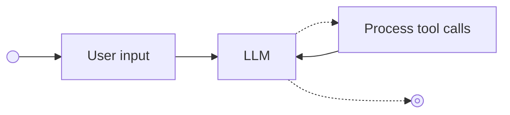

# The Agent Loop

Building the core of your coding agent

---

## What We'll Learn

- Creating an agent application from scratch
- Understanding the agent loop pattern
- Connecting a terminal interface
- Testing your agent

---

## Agent Architecture

---

## The Agent Loop Pattern

---

## What Makes a Good Agent Loop?

1. **Clear state management** - Track what the agent is doing
2. **Tool execution** - Allow the agent to take actions
3. **Error handling** - Gracefully handle failures
4. **User feedback** - Keep the user informed

---

## Let's Build It!

In this module we will:

1. Create the agent application structure
2. Implement the core agent loop
3. Connect a terminal interface
4. Test our implementation
